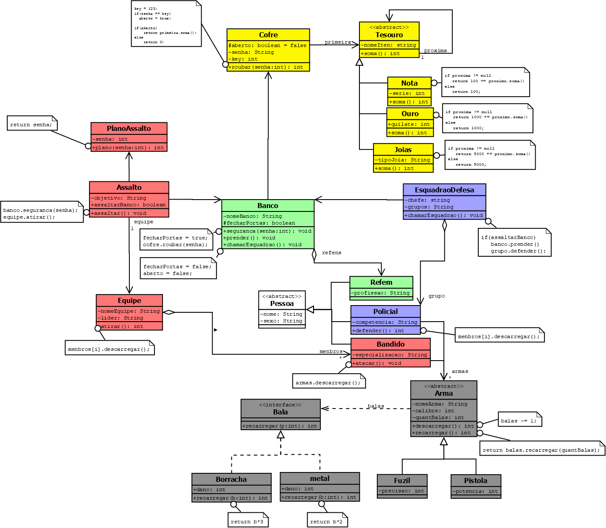

<h1 align="center" style="font-weight: bold;">Banco de dados - Java 💻</h1>


<p align="center">
 <a href="#started">Getting Started</a> • 
  <a href="#routes">API Endpoints</a> •
 <a href="#colab">Collaborators</a> •
 <a href="#contribute">Contribute</a>
</p>

<h2 id="started">🚀 Diagrama de Classe - Banco de dados</h2>
<br>

<p align="center">
  <b>
    Este projeto é uma aplicação Java desenvolvida para gerenciar um sistema banco de dados,foi um trabalho proposto para diciplina de Banco de Dados.
  </b>
</p>

<h2 id="started">🚀 Getting started</h2>

Para executar siga os passos abaixo

<h3>Prerequisites</h3>

- [Eclipse](https://github.com/)
- [java](https://github.com)
- [dia](https://github.com)

<h3>Cloning</h3>

Como clonar esse projeto

```bash
git clone https://github.com/Carlosxc-dev/projeto_banco_dados_java.git
```

<h3>Starting</h3>

Abra a pasta do projeto no eclipse e execute o projeto.

<h2 id="colab">🤝 Collaborators</h2>

<table>
  <tr>
    <td align="center">
      <a href="#">
        <br>
        <sub>
          <b>Carlos Henrique</b>
        </sub>
      </a>
    </td>
  </tr>
</table>

<h3>Documentations that might help</h3>

[📝 How to create a Pull Request](https://www.atlassian.com/br/git/tutorials/making-a-pull-request)

[💾 Commit pattern](https://gist.github.com/joshbuchea/6f47e86d2510bce28f8e7f42ae84c716)
